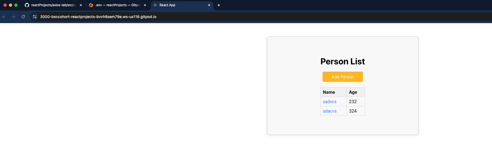
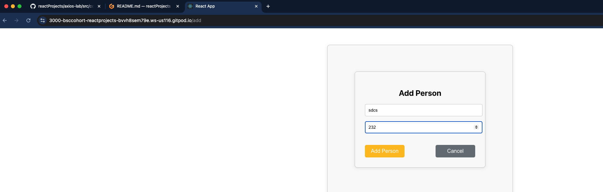
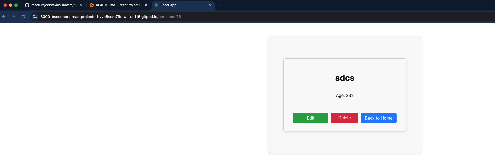
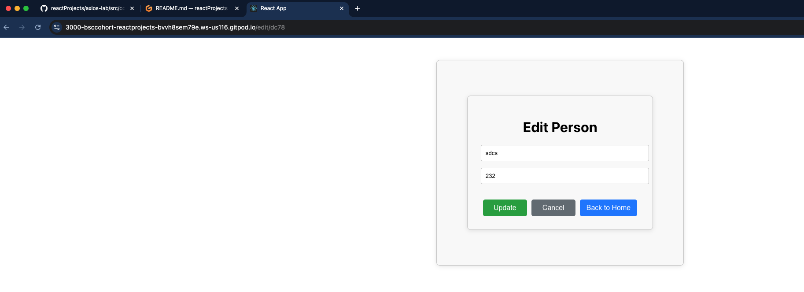

### How to run this project

```
# in one terminal run the db
npm run db

# in another terminal run the app
npm run app

# make both db and app public in gitpod
# then try the CRUD operations in the site available at the 3000 port
```

### The outputs look like this

- **PersonList page**

  

- **PersonAdd page**

  

- **PersonDetail page**

  

- **PersonEdit page**

  

### Environment Setup

- Install the packages
- Setup the DB
- Setup the dotenv file
- Setup the component directory
- Setup the styling directory